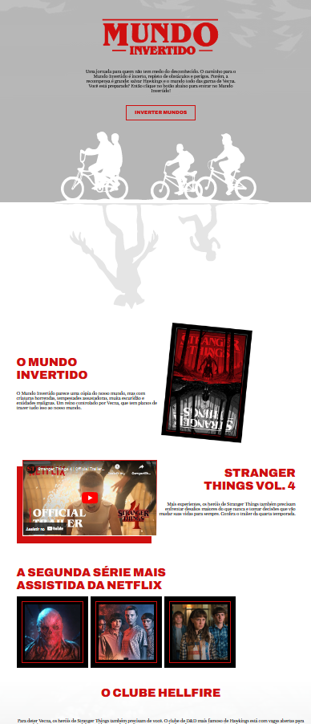

<h1 align="center"> Mundo Invertido </h1>

  <a href="#-tecnologias">Tecnologias</a>&nbsp;&nbsp;&nbsp;|&nbsp;&nbsp;&nbsp;
  <a href="#-projeto">Projeto</a>

 

  

## 🚀 Tecnologias

Esse projeto foi desenvolvido com as seguintes tecnologias:

- HTML e CSS
- JavaScript
- Firebase
- Git e Github

## 💻 Projeto

Projeto construído para fins didáticos, com o objetivo de colocar em prática conhecimentos de HTML, CSS e JavaScript aprendidos na DIO.\_.

Você pode visualizar o projeto através [DESSE LINK](https://viviansanchez.github.io/Semana-Front-End-Dio/)!
